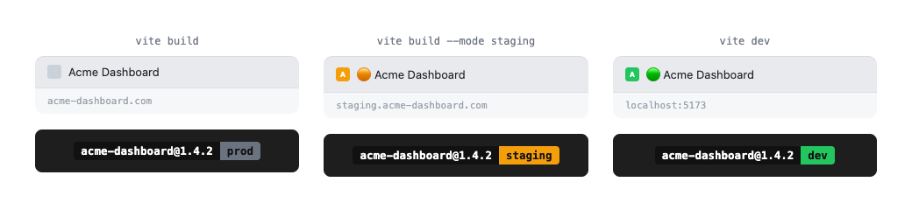
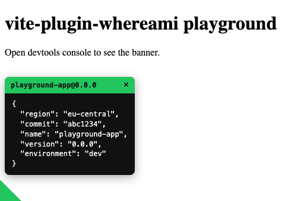

# vite-plugin-whereami

Tints your favicon and prefixes the page title per environment, so you never
mistake a staging tab for prod again — plus an optional build-info banner
(name/version/environment) in `<head>` and the browser console, and an
on-screen corner badge for build info that's always visible, custom
metadata included.

Inspired by [this tip](https://x.com/dferber90) about using a different favicon
per environment to keep tabs visually distinct.



## Install

```sh
bun add -D vite-plugin-whereami
```

### Or, let an AI coding agent do it

Paste this into Claude Code, OpenCode, Cursor, Copilot, or whatever agent you're using:

```
Install and configure vite-plugin-whereami (https://www.npmjs.com/package/vite-plugin-whereami)
in this project:

1. Add it as a dev dependency with this project's package manager.
2. Wire it up for this project's framework:
   - Plain Vite: add `whereami()` to the `plugins` array in vite.config.ts/js.
   - SvelteKit: DON'T add the Vite plugin (it's a no-op there). Instead add
     `whereamiHandle()` to `src/hooks.server.ts`, and pass the app's name/version
     imported from package.json so it works on edge runtimes:
     `import { name, version } from "../package.json";`
     `export const handle = whereamiHandle({ pkg: { name, version } });`
     (use `sequence()` from `@sveltejs/kit/hooks` if there are other handlers).
     See https://github.com/mastermakrela/whereami#sveltekit.
3. Check how/where this project deploys (vercel.json, .vercel/, wrangler.toml or
   wrangler.jsonc, CI/CD workflow files). Vercel and Cloudflare Pages are
   auto-detected out of the box, so usually nothing else is needed. If it deploys
   somewhere else, or the default prod/staging/dev mapping doesn't match this
   project's branches/environments, add a custom `detect` option per
   https://github.com/mastermakrela/whereami#environment-detection.
4. Leave favicon tinting, the build-info banner, and the on-screen badge at their
   defaults — don't enable extra options unless asked. Full reference:
   https://github.com/mastermakrela/whereami
```

## Quick start

```ts
// vite.config.ts
import { defineConfig } from "vite";
import whereami from "vite-plugin-whereami";

export default defineConfig({
	plugins: [whereami()],
});
```

That's it. By default:

- **prod** (`vite build`, i.e. `mode: "production"`) — no changes at all.
- **staging** (`vite build --mode staging`) — 🟠 orange favicon tint + `🟠 ` title prefix.
- **dev** (`vite dev`, or any other/unknown mode) — 🟢 green favicon tint + `🟢 ` title prefix.

Unknown modes default to `dev`'s tint on purpose — the whole point is to make it
obvious when you're _not_ looking at production, so an unrecognized mode should
look suspicious, not blend in.

If your project already has a favicon (`<link rel="icon">` in `index.html`, or
`public/favicon.{svg,png}`), it gets tinted (hue/saturation swapped for the
environment color, lightness preserved — a shape-preserving recolor, not a
flat overlay). If there's none, a simple icon is generated using the first
letter of your `package.json` name.

## Environment detection

By default, whereami checks, in order:

1. the `WHEREAMI_ENV` environment variable, if set
2. a few popular hosting platforms' own environment variables:
   - **Vercel** — `VERCEL_ENV`: `production` → `prod`, `preview` → `staging`, `development` → `dev`
   - **Cloudflare Pages** — [`CF_PAGES`/`CF_PAGES_BRANCH`](https://developers.cloudflare.com/pages/configuration/build-configuration/#environment-variables): the `main`/`master` branch → `prod`, any other branch → `staging`
   - **Node** — `NODE_ENV=production` → `prod`
3. Vite's `mode`: `"production"` → `prod`, `"staging"` → `staging`, anything else → `dev`

You can fully replace this with your own function — return any string key,
matched against `environments`:

```ts
whereami({
	detect: ({ mode, env }) => {
		// https://developers.cloudflare.com/pages/configuration/build-configuration/#environment-variables
		if (env.CF_PAGES === "1") {
			return env.CF_PAGES_BRANCH === "main" ? "prod" : "staging";
		}
		return mode === "production" ? "prod" : "dev";
	},
});
```

## Custom environments

```ts
whereami({
	environments: {
		prod: {}, // no color/titlePrefix = no changes
		staging: { color: "#f59e0b", titlePrefix: "🟠 [staging] " },
		dev: { color: "#22c55e", titlePrefix: "🟢 [dev] " },
		qa: { color: "#a855f7", titlePrefix: "🟣 [qa] " },
	},
	detect: ({ mode }) => (mode === "qa" ? "qa" : undefined) ?? "prod",
});
```

Any environment whose config has no `color` gets no favicon change, and no
`titlePrefix` gets no title change — this is how `prod` stays a no-op by
default without special-casing it in the plugin itself.

## Favicon options

```ts
whereami({
	favicon: {
		enabled: true, // set false to disable favicon tinting/generation entirely
		path: "public/logo.svg", // explicit source; auto-detected otherwise
	},
});
```

Only `.svg` and `.png` sources are supported. `.ico` (or anything else) falls
back to generating the default letter icon, with a console warning.

## Build-info banner

Injects `<meta>` tags and a styled `console.log` with your package's name,
version, and detected environment — in **every** environment, including prod,
unless you disable it:

```ts
whereami({
	banner: {
		enabled: true, // master switch
		meta: true, // <meta name="app-name" content="..."> etc.
		console: true, // the console.log banner
		metaPrefix: "app", // -> app-name, app-version, app-environment
	},
});

// or shorthand to disable everything:
whereami({ banner: false });
```

## On-screen badge

A small colored triangle, fixed to the bottom-left corner, in every non-prod
environment (same "no `color`, no badge" rule as the favicon — prod stays a
no-op by default). Click it to open a panel with the same info as the console
banner, in a `<pre>` block:



Dismiss it by clicking the × button, clicking anywhere outside the panel, or
pressing Escape.

```ts
whereami({ badge: { enabled: true } });

// or shorthand to disable it:
whereami({ badge: false });
```

## Served SVG badge (SvelteKit)

`whereamiHandle()` can also serve a small SVG status badge at a fixed URL, so
a GitLab/GitHub project badge can point at your _running deployment_ and show
the live version — no third-party badge service, no CI step keeping a badge
image in sync:

```ts
whereamiHandle({
	pkg: { name, version },
	badgeEndpoint: {
		path: "/_whereami/badge.svg", // required — setting this enables the feature
		label: "deployed", // default
		show: ["version"], // default; also: "name", "environment"
		color: "#0b7285", // default: the environment's color, else this teal
	},
});
```

Point a GitLab project badge at it under **Settings → General → Badges**:

```
Badge image URL: https://your-app.example.com/_whereami/badge.svg
Link:            https://your-app.example.com
```

**This endpoint is public and unauthenticated** — anyone who knows (or
guesses) the path can request it, with no way to gate access here. It
deliberately renders only the fields listed in `show`; it never exposes
`metadata`, environment variables, or anything else. Responses are served
with `cache-control: no-cache` and an `ETag` (so repeat requests get a cheap
`304`) — the whole point is that the badge always reflects what's currently
deployed, not a cached snapshot.

It only exists on `whereamiHandle()`, not the Vite plugin: a plain Vite app
is just static files in production, with no server left at request time to
answer this request.

## Custom metadata

Anything you pass to `metadata` shows up in both the console banner (as a
second, inspectable `console.log`) and the badge's panel, merged with the
built-in name/version/environment (which always win on a key clash):

```ts
whereami({
	metadata: {
		region: process.env.FLY_REGION,
		commit: process.env.GITHUB_SHA?.slice(0, 7),
	},
});
```

Values must be JSON-serializable — they're embedded into the injected script
at build/dev-server-start time, not read at request time.

## SvelteKit

SvelteKit renders pages through its own SSR pipeline and never calls Vite's
`transformIndexHtml` hook, so the regular `whereami()` plugin is a no-op there —
you don't need it in `vite.config.ts`. Use the `vite-plugin-whereami/sveltekit`
entry point instead, which does the same favicon/title/banner/badge injection
through SvelteKit's own `transformPageChunk`, wired into `hooks.server.ts`:

```ts
// src/hooks.server.ts
import { sequence } from "@sveltejs/kit/hooks";
import { name, version } from "../package.json";
import { whereamiHandle } from "vite-plugin-whereami/sveltekit";

export const handle = sequence(
	whereamiHandle({ pkg: { name, version } }) /* ...your other handlers */,
);
```

Importing `name`/`version` from `package.json` and passing them as `pkg` is what
lets `whereamiHandle()` label the banner/badge with **no filesystem access at
request time**, including on edge/isolate runtimes (Cloudflare Workers, Vercel
Edge, Deno Deploy) that don't have one: the import is inlined into your
`hooks.server.ts` — always part of the server bundle — at build time. Omit
`pkg` and it falls back to reading `package.json` off disk at request time
instead — fine on Node-based deployments; on an edge runtime it logs a one-time
warning and labels the app `app@0.0.0`.

The handle itself is runtime-agnostic either way: it never statically imports a
Node builtin (or `Buffer`, or `process`), so a Cloudflare Workers deploy needs
**no `nodejs_compat` compatibility flag** to use it. Node's `fs` is loaded
lazily, only on runtimes that have it, purely to serve that `package.json`
fallback and to read a favicon off disk.

`whereamiHandle()` takes the same options as the Vite plugin, with two other
differences:

- There's no Vite `mode`/`command` at request time (this runs in the already-
  built, deployed server), so the default detector trusts `NODE_ENV=production`
  outright instead of only during `serve` — the `WHEREAMI_ENV` env var and the
  Vercel/Cloudflare Pages checks work exactly the same way.
- The favicon is inlined as a `data:` URI in the `<link>` tag rather than served
  from a separate emitted file, since there's no Vite build pipeline to emit
  assets into at request time. A custom `favicon.path` is still unreachable on
  edge runtimes without a filesystem; the generated letter icon is used
  instead, correctly once the name is resolved.

## Full options reference

```ts
interface WhereAmIOptions {
	detect?: (ctx: {
		mode: string;
		command: "build" | "serve";
		env: Record<string, string>;
	}) => string;
	environments?: Record<string, { color?: string; titlePrefix?: string }>;
	favicon?: { enabled?: boolean; path?: string };
	banner?: boolean | { enabled?: boolean; meta?: boolean; console?: boolean; metaPrefix?: string };
	badge?: boolean | { enabled?: boolean };
	metadata?: Record<string, unknown>; // must be JSON-serializable
	packageJsonPath?: string; // default: "package.json"
	pkg?: { name: string; version: string }; // bypasses packageJsonPath/fs when set
	badgeEndpoint?: {
		path: string; // e.g. "/_whereami/badge.svg" — required, enables the feature
		label?: string; // default: "deployed"
		show?: Array<"name" | "version" | "environment">; // default: ["version"]
		color?: string; // default: the environment's color, else "#0b7285"
	}; // SvelteKit only, see "Served SVG badge" above
}
```

## Development

```sh
bun install
bun run test          # vitest (unit + integration against fixture vite projects)
bun run build         # tsup -> dist/
bun run typecheck
bun run lint          # oxlint
bun run format:check  # oxfmt --check
```

`playground-app/` is a throwaway Vite project (gitignored) useful for manual
checks:

```sh
bun run playground         # starts a dev server against playground-app
bun run playground:build   # runs a production build of playground-app
```

Both rebuild the plugin first, so changes under `src/` show up on the next run.
To try a different environment, pass `--mode`, e.g.
`vite build playground-app --mode staging` (or set `WHEREAMI_ENV=staging`).

## Releasing

This repo uses [Changesets](https://github.com/changesets/changesets) for
versioning/changelogs and npm's [OIDC trusted publishing](https://docs.npmjs.com/trusted-publishers/)
for the actual `npm publish` — no `NPM_TOKEN` secret needed, as long as this
package's Trusted Publisher on npmjs.com is configured to point at this
GitHub repo and the `Release` workflow.

1. Run `bun run changeset` to describe your change (patch/minor/major + summary).
2. Commit the generated `.changeset/*.md` file and push to `main`.
3. The `Release` workflow bumps the version and updates `CHANGELOG.md` (committing
   that straight back to `main`, no PR/review step), then publishes to npm with
   `npm publish` (the one command that actually supports trusted publishing —
   bun/pnpm don't yet) — all in the same run.

## License

MIT
